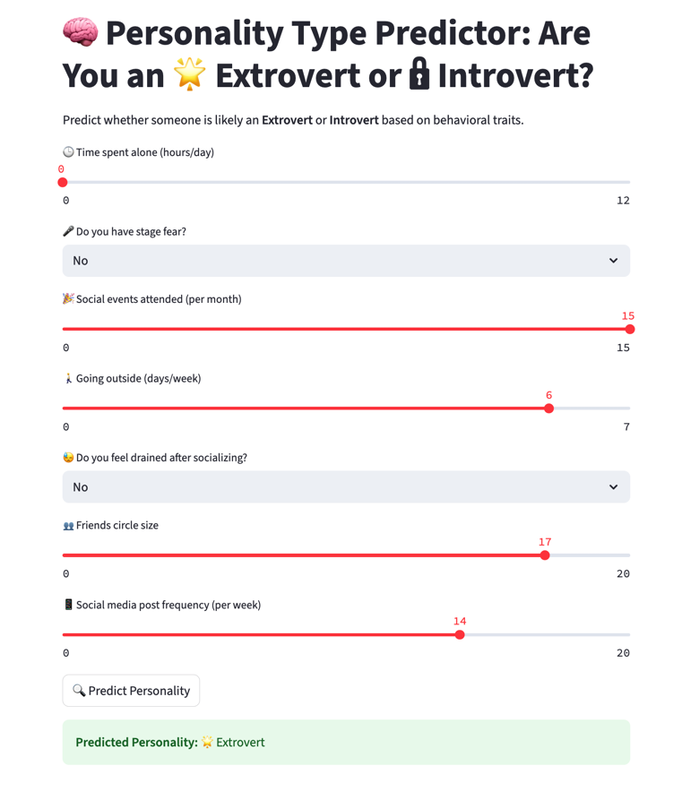
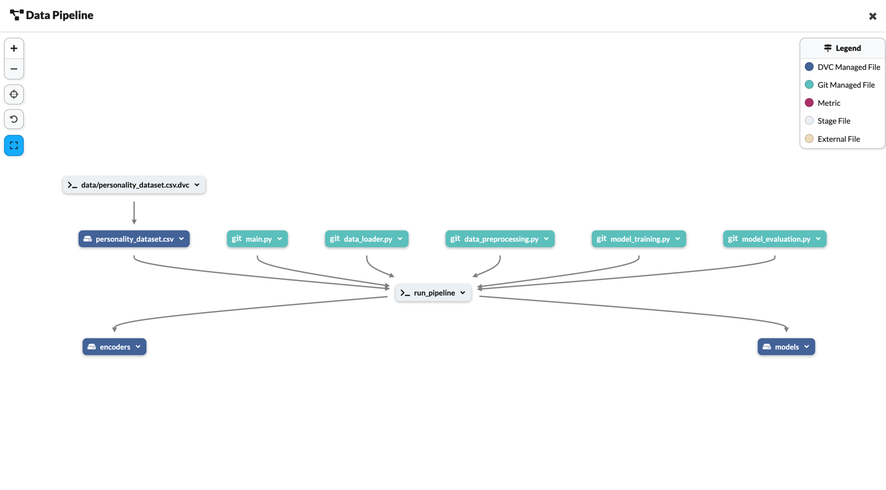

# 🧠 Extrovert vs. Introvert Classification – End-to-End MLOps Pipeline

This project is an end-to-end Machine Learning workflow that classifies individuals as **Extroverts** or **Introverts** using psychological and behavioral traits. It follows complete **MLOps practices** using:

- **Modular ML pipeline**
- **DVC** for data & model versioning
- **MLflow via DagsHub** for remote experiment tracking
- **GitHub Actions** for CI/CD automation
- **Streamlit** for deployment-ready app
  
---

## 🚀 Project Features

- 🔄 Modular ML pipeline with reusable Python scripts
- 📦 Data versioning & reproducibility using DVC
- 📊 Experiment logging with MLflow (hosted on DagsHub)
- 🛠️ Automated CI/CD with GitHub Actions
- 🌐 Interactive personality classifier deployed using Streamlit

🎯 **Streamlit app:**  
🌐 [🧪 Streamlit Personality Classifier](https://opxbayvkxbfpzepdf4sdrm.streamlit.app/)


📊 **Experiment Tracking:**  
📁 [🔍 MLflow Experiments on DagsHub](https://dagshub.com/jeevitharamsudha16/Extrovert-vs.-Introvert-Classification-End-to-End-MLOps-Pipeline-with-DVC-MLflow-CI-CD.mlflow/#/experiments/0?searchFilter=&orderByKey=attributes.start_time&orderByAsc=false&startTime=ALL&lifecycleFilter=Active&modelVersionFilter=All+Runs&datasetsFilter=W10%3D&compareRunsMode=TABLE)

**Dagshub pipeline**
[Dags hub pipeline](https://dagshub.com/jeevitharamsudha16/Extrovert-vs.-Introvert-Classification-End-to-End-MLOps-Pipeline-with-DVC-MLflow-CI-CD)


📂 **Source Code Repository:**  
💻 [📦 GitHub Repo](https://github.com/jeevitharamsudha16/Extrovert-vs.-Introvert-Classification-End-to-End-MLOps-Pipeline-with-DVC-MLflow-CI-CD)


## 📂 Key Files Explained

| File/Folder               | Purpose                                                                 |
|--------------------------|-------------------------------------------------------------------------|
| `.dvc/`                  | Internal DVC tracking for datasets and pipelines                        |
| `.github/workflows/`     | GitHub Actions workflow for CI/CD                                       |
| `data/`                  | Raw and reference data tracked by DVC                                   |
| `artifacts/`             | Output folder for models/plots/metrics                                  |
| `data_loader.py`         | Loads dataset and performs initial checks                               |
| `data_preprocessing.py`  | Cleans, encodes, and splits data into train/test                        |
| `model_training.py`      | Trains ML models and logs with MLflow (remote via DagsHub)              |
| `model_evaluation.py`    | Evaluates metrics like accuracy, precision, recall, F1                  |
| `main.py`                | Runs full ML pipeline end-to-end                                        |
| `app.py`                 | Streamlit app for real-time personality classification                  |
| `dvc.yaml`               | DVC pipeline stages and commands                                        |
| `dvc.lock`               | Version-locked reference to data and outputs                            |
| `.env`                   | Environment variables (e.g., MLflow URI, keys)                          |
| `requirements.txt`       | Required Python libraries for project                                   |

---

## ⚙️ MLOps Stack

| Tool        | Purpose                            |
|-------------|------------------------------------|
| **DVC**     | Data & pipeline versioning         |
| **MLflow**  | Experiment tracking (hosted on DagsHub) |
| **DagsHub** | Remote storage & MLflow hosting    |
| **GitHub**  | Code versioning                    |
| **GitHub Actions** | CI/CD pipeline automation     |
| **Streamlit** | Web-based model inference UI     |

---

## 🧪 Installation

```bash
# 1. Clone repo
git clone https://github.com/jeevitharamsudha16/Extrovert-vs.-Introvert-Classification-End-to-End-MLOps-Pipeline-with-DVC-MLflow-CI-CD.git
cd Extrovert-vs.-Introvert-Classification-End-to-End-MLOps-Pipeline-with-DVC-MLflow-CI-CD

# 2. Create and activate virtual environment
python -m venv env
source env/bin/activate  # or use `env\Scripts\activate` on Windows

# 3. Install dependencies
pip install -r requirements.txt

# 4. Pull data from DVC (linked with DagsHub)
dvc pull

## ▶️ **Run Modular Pipeline** 

Each stage of the pipeline is modular and can be executed independently:

```bash
python data_loader.py
python data_preprocessing.py
python model_training.py
python model_evaluation.py

Or run the complete pipeline using:
python main.py

## 📊 MLflow Tracking via DagsHub

All experiments are logged remotely using **DagsHub’s hosted MLflow**.

You can:

- 📈 [View metrics, parameters, and artifacts remotely](https://dagshub.com/jeevitharamsudha16/Extrovert-vs.-Introvert-Classification-End-to-End-MLOps-Pipeline-with-DVC-MLflow-CI-CD.mlflow/#/experiments/0?searchFilter=&orderByKey=attributes.start_time&orderByAsc=false&startTime=ALL&lifecycleFilter=Active&modelVersionFilter=All+Runs&datasetsFilter=W10%3D&compareRunsMode=TABLE)
- 🖥️ [Explore the deployed Streamlit app](https://3ddosdpzvpvejkahcebxuv.streamlit.app/)
- 🥇 Compare models and promote the best one using the MLflow UI

To run MLflow locally (optional):

```bash
mlflow ui
# Then open: http://localhost:5000

## 🔁 CI/CD Pipeline (GitHub Actions)

On every **push** or **pull request**, the following actions are triggered:

- ✅ Pull data from DVC remote storage  
- ✅ Run linting and unit tests  
- ✅ Execute the ML pipeline and log results to MLflow (via DagsHub)  
- ✅ *(Optional)* Auto-deploy the best model to Streamlit Cloud  

---

## 🌐 Streamlit App Deployment
https://opxbayvkxbfpzepdf4sdrm.streamlit.app/ 

To run the app locally:

```bash
streamlit run app.py

